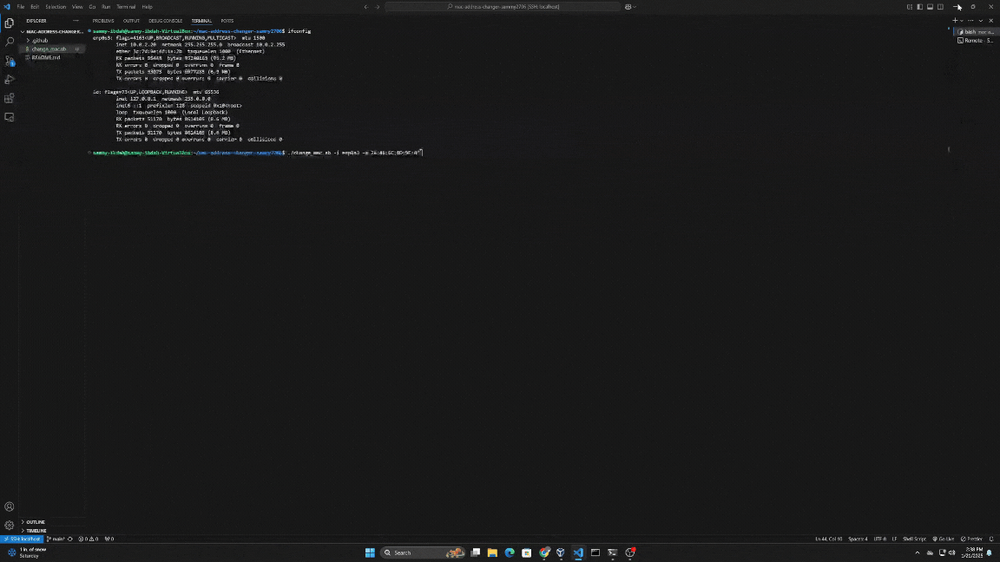
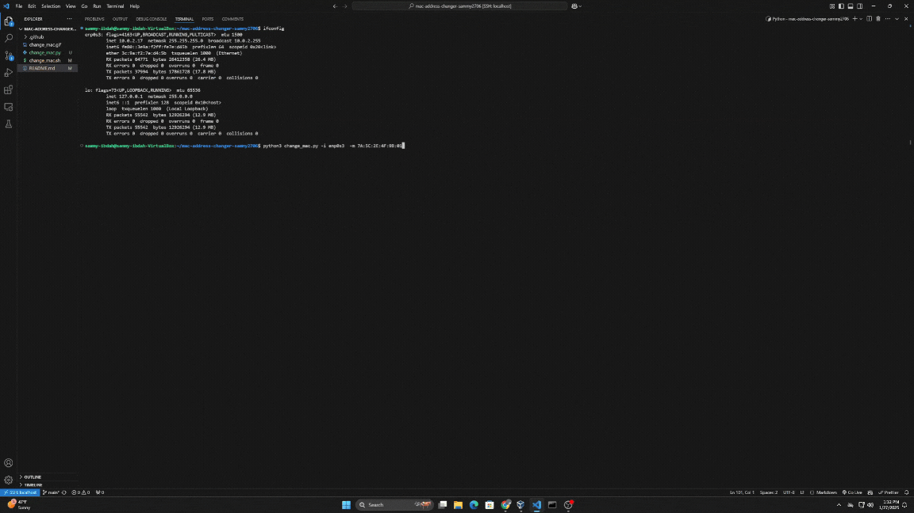

[](https://classroom.github.com/a/tp86o73G)
[](https://classroom.github.com/open-in-codespaces?assignment_repo_id=17729428)

# Mac Address Changer
This script is a simple tool for changing the MAC address of a specified network interface through Shell Script or Python. It validates user inputs, applies the new MAC address, and provides error handling for common issues.

## Requirements
### Shell Script
- Make sure it's running on bash
- Make sure the script is an executable: `chmod +x change_mac.sh`
### Python
- Make sure to install python3
- Use the following link: `https://www.python.org/downloads/`
## Usage
### Shell Script:
To run the script use the following command:
```bash
./change_mac.sh -i <interface> -m <MAC address>
```

### Examples
**Example 1: Change the MAC address of** `eth0`
```bash 
./change_mac.sh -i eth0 -m A1:B4:C5:C1:DD:3E
```
**Example 2: Change the MAC address of** `wlan0`
```bash
./change_mac.sh -i wlan0 -m 00:11:22:33:44:55
```
### Python:
To run the script use the following commad:
```bash
python3 -i <interface> -m <MAC address>
```
### Examples
**Example 1: Change the MAC address of** `eth0`
```bash
python3 -i eth0 -m A1:B4:C5:C1:DD:3E
```
**Example 2: Change the MAC address of** `wlan0`
```bash
python3 -i wlan0 -m 00:11:22:33:44:55
```

## Error Handling
### Usage Instructions Displayed

### Shell Script:


```bash
Usage: ./change_mac.sh -i <interface> -m <MAC address>

Options:
  -i    Network interface (e.g., eth0, wlan0)
  -m    New MAC address in the format A1:B4:C5:C1:DD:3E

Examples:
  ./change_mac.sh -i eth0 -m A1:B4:C5:C1:DD:3E
  ./change_mac.sh -i wlan0 -m 00:11:22:33:44:55
```
### Python:
```bash
Usage: python3 <interface> <new_mac>

Options:
-i    Network interface (e.g., eth0, wlan0)
-m    New MAC address in the format A1:B4:C5:C1:DD:3E

Examples:
python3 -i eth0 -m A1:B4:C5:C1:DD:3E
python3 -i wlan0 -m 00:11:22:33:44:55
```
### Invalid MAC address Format:
-  If the provided MAC address is not in the format `A1:B4:C5:C1:DD:3E`, the script will display the usage instructions and exit.
### Missing Required Arguments:
- If either the -i or -m option is missing, the script will display the usage instructions and exit.
### Input Validation
- The MAC address format is validated using a regular expression: `^[A-F0-9]{2}(:[A-F0-9]{2}){5}$.`
- The script ensures that both the `-i` and `-m` arguments are provided before executing any commands.

## Troubleshooting Tips

### Error: ```Command not found: ifconfig```
- Solution: Install `net-tools`:
```
sudo apt update && sudo apt install net-tools
```
### Error: `Usage` message displayed
- Cause: Invalid or missing arguments.
- Solution: Ensure both `-i` and `-m` options are provided and the MAC address fromat is correct. 


## Script in Action
### Shell Script:



### Python:
